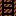
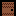

# [TITRE ]
##### Projet Nuit Du Code 2024 de Funasitien, Bugxit et Boss-MBD

## A propos du jeu
[ TITRE ] est un jeu inspiré du classique *démineur* - vous devez récupérer le plus de points possible en descendant  dans la mine chercher des coffres - mais comme tout le monde vous ne savez pas voler.

## Controles
Vous avez trois option quand vous ouvrez le jeu - **WASD**, **ZQSD** et **Flèches Directionnelles**. Vous pouvez changer à tout moment en appuyant sur **Entré** qui met le jeu en pause.

## Cartes
X cartes sont disponibles. Vous pouvez changer de carte en utilisant la porte en bas du niveau. Chaque niveau est composé blocs; 
-  Les blocs de terre, cassable par le joueur
-  Les tunnels, des espaces vides que le joueur peut traverser - mais pas survoler, il ne vole pas !
-  Les pierres, incasable par notre pauvre héro
-  Les coffres, qui augemente le score et offre deux secondes suplémentaires pour vivre dans la mine
-  Les Echelles, le seul moyen de remonter dans la mine
-  Les portes, qui permettent d'accéder à un autre niveau 

## JSP
